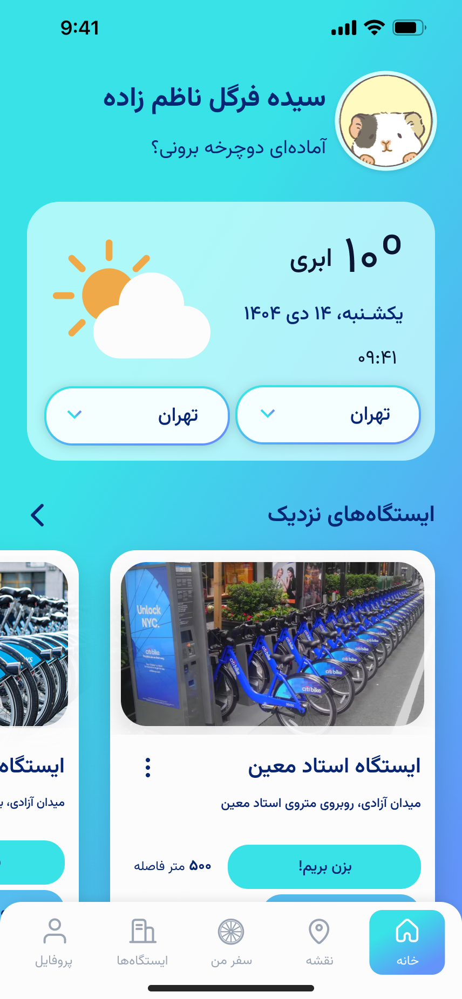
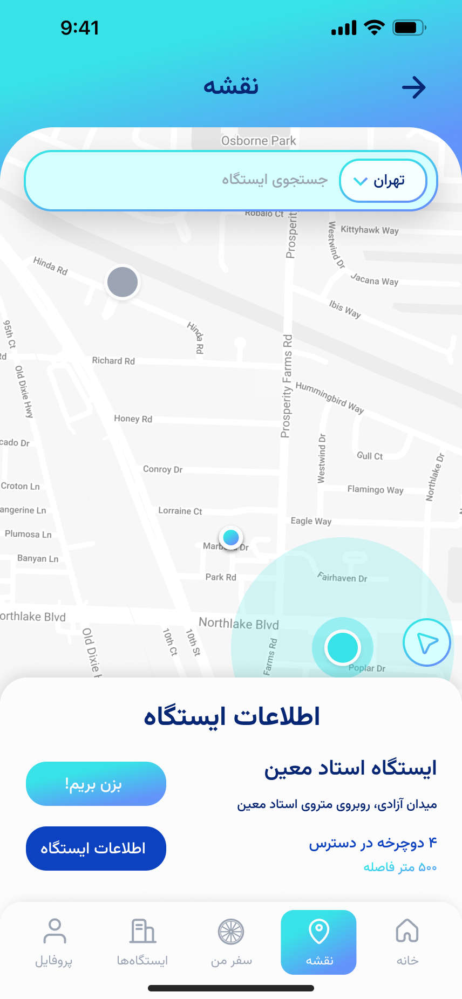
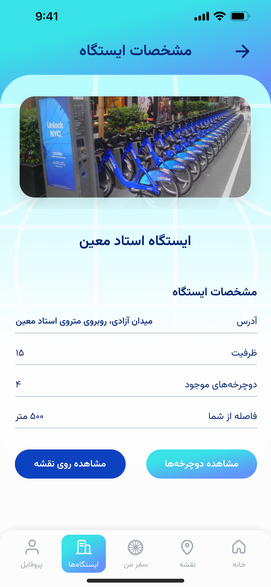
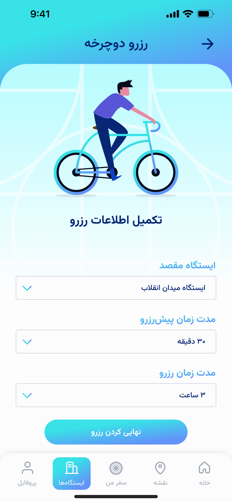
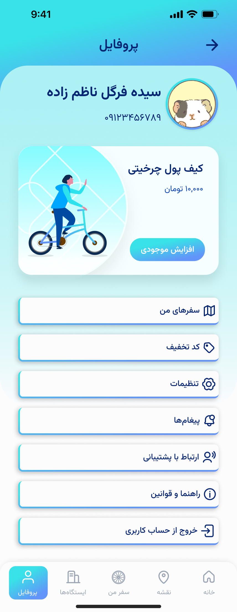
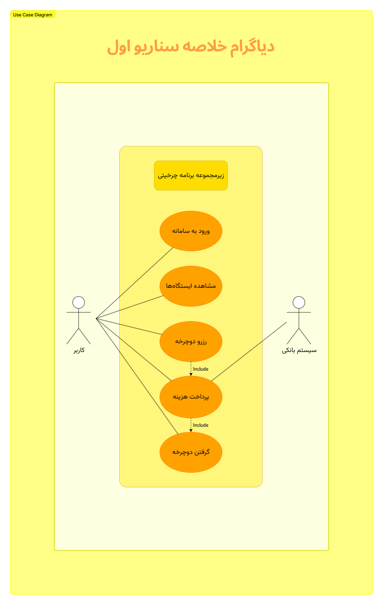
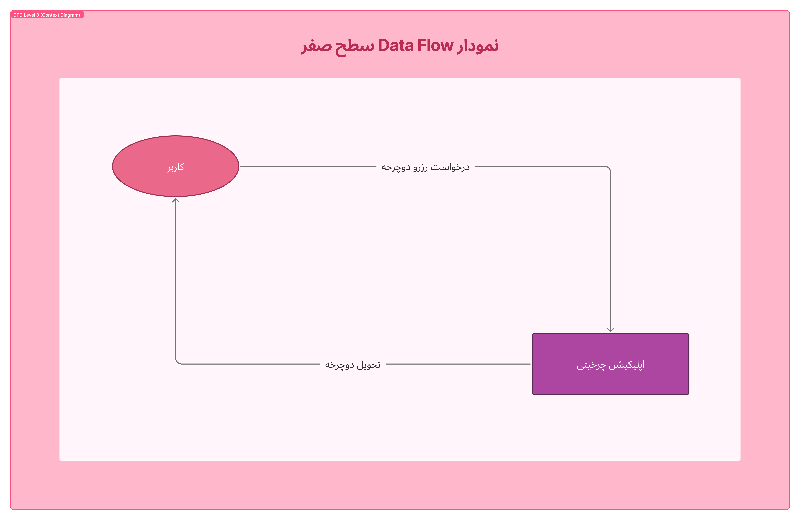
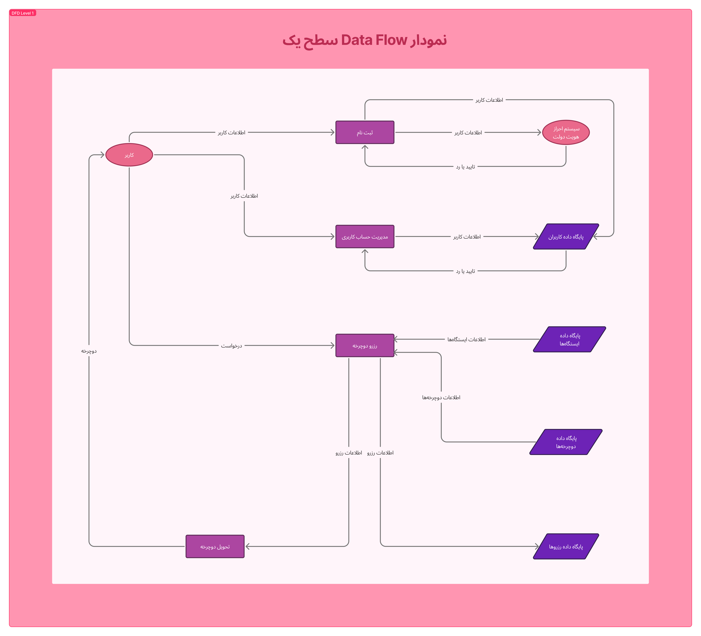
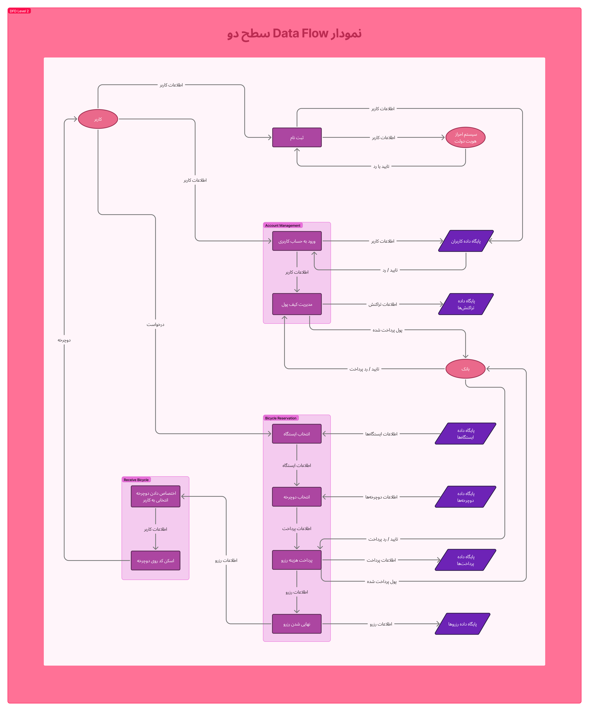
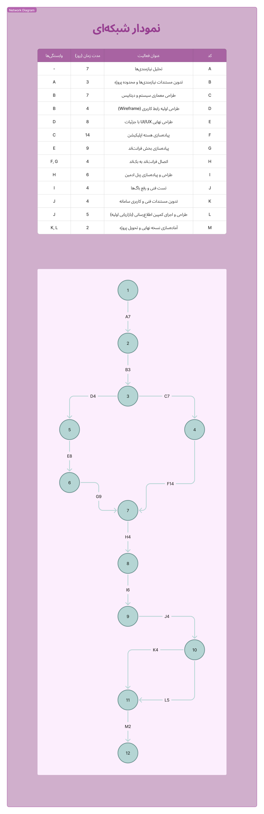

# 🚲 Charkhity - Urban Bike Sharing Platform

A comprehensive software engineering project focused on the analysis, design, and prototyping of a smart urban bike-sharing platform.

Designed as an academic software engineering project, the system aims to provide a convenient, sustainable, and technology-driven transportation solution for urban environments.

---

# 📌 Project Overview

Charkhity is a mobile-based bike-sharing platform that enables users to locate, reserve, unlock, use, and return bicycles across different stations within a city.

The platform is designed to address common urban transportation challenges such as traffic congestion, limited parking availability, environmental concerns, and accessibility for short-distance travel.

Charkhity is specifically designed for Persian-speaking users and urban transportation scenarios in Iran. Localization considerations such as Persian language support, user behavior patterns, payment workflows, and city-based bicycle station management were incorporated during the design process.

---

# 📍 Project Status

This repository contains the analysis, design, and prototyping phases of the project.

The system has not been implemented yet and serves as a complete software engineering case study.

---

# 👩🏻‍💻 Developer

**Seyyedeh Fargol Nazemzadeh**

---

# 🎯 Project Objectives

* Promote sustainable transportation
* Reduce short-distance vehicle usage
* Improve urban mobility
* Encourage healthy lifestyles
* Support smart city initiatives
* Provide a seamless bicycle rental experience
* Increase accessibility to urban transportation
* Deliver a localized user experience for Persian-speaking citizens

---

# 🔄 Design Process

The project follows a structured software engineering workflow:

```text
User Research
      ↓
Requirements Gathering
      ↓
Requirements Analysis
      ↓
Risk Assessment
      ↓
Scope Definition
      ↓
Database Design
      ↓
System Modeling
      ↓
UI/UX Design
      ↓
Interactive Prototype
```

---

# ✨ Core Features

The designed system includes support for:

## 👤 User Features

* User registration and authentication
* Identity verification
* Bicycle search and discovery
* Real-time station availability
* Bicycle reservation
* QR-code bicycle unlocking
* Ride tracking
* Ride history
* Wallet management
* Online payments
* Discount code support
* Report issue submission
* Bicycle rating and feedback
* Profile management
* Notification system

---

## 🚲 Bicycle Rental Features

* Real-time bicycle availability
* Nearby station discovery
* Bicycle reservation before arrival
* Bicycle pickup and return workflow
* Ride extension
* Rental status tracking
* Bicycle condition monitoring

---

## 💳 Payment & Wallet Features

* In-app wallet
* Wallet top-up
* Payment history
* Automatic rental fee calculation
* Discount code redemption
* Subscription-ready architecture

---

## 🛠️ Administrative Features

* Bicycle management
* Station management
* User management
* Rental monitoring
* Maintenance scheduling
* Report management
* Discount code administration
* Usage analytics

---

# 📂 Repository Structure

```text
Charkhity-Bike-Sharing-Platform/
│
├── Analysis/
│   ├── Feasibility.png
│   ├── Feature-List.png
│   ├── Personas-And-Scenarios.png
│   ├── Questionnaire.png
│   ├── Risk-Analysis.png
│   └── Scope-Definition.png
│
├── Diagrams/
│   ├── Data-Flow-Diagram-Level-0.png
│   ├── Data-Flow-Diagram-Level-1.png
│   ├── Data-Flow-Diagram-Level-2.png
│   ├── Data-Flow-Diagrams.png
│   ├── Entity-Relationship-Diagram.png
│   ├── Network-Diagram.png
│   └── Use-Case-Diagram.png
│
├── UI-UX/
│   ├── Bicycle-Specifications.png
│   ├── Extending-Trip.png
│   ├── Home.png
│   ├── Map-Station.png
│   ├── Profile.png
│   ├── Reservation.png
│   ├── Start-Trip.png
│   └── Station-Specifications.png
│
├── Charkhity-Project-Documentation.pdf
└── README.md
```

---

# 👤 User Journey

A typical user interaction flow:

```text
Open Application
        ↓
Find Nearby Station
        ↓
View Available Bicycles
        ↓
Reserve Bicycle
        ↓
Unlock via QR Code
        ↓
Start Ride
        ↓
Return Bicycle
        ↓
Payment & Ride Summary
```

---

# 🎨 UI/UX Design

The project includes a high-fidelity UI/UX prototype created in Figma to demonstrate the proposed user experience and system workflow.

## 🎯 Design Goals

* Fast bicycle access
* Minimal user friction
* Clear ride information
* Simple payment workflow
* Mobile-first experience
* Consistent visual design

## 🌍 Localization Considerations

The application was designed with Persian-speaking users in mind.

Key localization aspects include:

- Persian (RTL) user interface design
- Familiar navigation patterns for Iranian users
- Localized payment workflow concepts
- Persian typography considerations
- User experience tailored to urban transportation habits in Iran

---

## 📱 UI Preview

This section provides some examples of Charkhity UI/UX design. more examples can be found in the UI-UX folder.

### 🏠 Home Dashboard



---

### 🗺️ Interactive Map



---

### 🚲 Station Information



---

### 🚲 Bicycle Reservation



---

### 👤 User Profile



---

# 🎨 Interactive Prototype

View the complete prototype on Figma:

**🔗 [Charkhity Prototype](https://www.figma.com/design/BECSL0mubxOnHqWHKYM7Ju/Charkhity-UI?node-id=0-1&t=1E7iw43V058KOlun-1)**

---

# 📋 Analysis & Design Activities

This project covers multiple phases of software analysis, requirements engineering, system modeling, and UI/UX design. The repository includes the following project artifacts and deliverables:

### 🔍 Feasibility Study

Evaluation of the project's technical, operational, economic, and organizational feasibility before defining the system scope.

### 📊 User Research & Survey Analysis

Design and distribution of user questionnaires, followed by analysis of responses to identify user needs, expectations, and pain points.

### 👤 Personas & Usage Scenarios

Development of user personas and real-world usage scenarios to better understand target users and guide system design decisions.

### ⚠️ Risk Analysis

Identification and assessment of technical, operational, security, financial, and organizational risks associated with the proposed system.

### 🎯 Scope Definition & Feature Planning

Definition of project boundaries, system objectives, functional requirements, and prioritized feature lists.

> Detailed analysis documents, system models, and supporting project artifacts are available in the **Analysis** and **Diagrams** folders for further review.

---

# 📐 System Modeling

The project includes several software engineering models and diagrams:

* Use Case Diagram
* Data Flow Diagrams (DFD)
* Entity Relationship Diagram (ERD)
* Network Diagram

## 🎭 Use Case Diagram



---

## 🔄 Data Flow Diagrams

### 0️⃣ DFD Level 0



### 1️⃣ DFD Level 1



### 2️⃣ DFD Level 2



---

## 🗄️ Entity Relationship Diagram


---

## 🕸️ Network Diagram



---

# 🛠️ Skills Demonstrated

* Requirements Engineering
* Stakeholder Analysis
* User Research
* Questionnaire Analysis
* Risk Management
* Software Modeling
* Database Design
* Data Flow Modeling
* UI Design
* UX Design
* Wireframing
* Prototyping
* Figma
* Draw.io
* Software Documentation

---

# 🚀 Future Improvements

Potential future developments include:

* Native mobile application development
* Smart bicycle lock integration
* GPS-based route recommendation
* AI-powered demand prediction
* Loyalty and reward systems
* Community and social features
* Public transportation integration

---

# 📚 Project Artifacts

This repository contains:

* Requirements Analysis
* Questionnaire Questions, Results And Analysis
* Risk Analysis
* Scope Definition
* Use Case Modeling
* DFD Diagrams
* Database Design
* Network Diagram
* UI/UX Prototype
* Project Documentation

---

# 🎓 Academic Project

This project was developed as part of the Systems Analysis and Design course to apply software engineering methodologies, requirements engineering techniques, system modeling approaches, and user-centered design principles in a real-world transportation scenario.

---

# 🙏🏻 Acknowledgments

* Systems Analysis and Design Course
* Faculty of Farabi, University of Tehran
* Academic Year 1403–1404